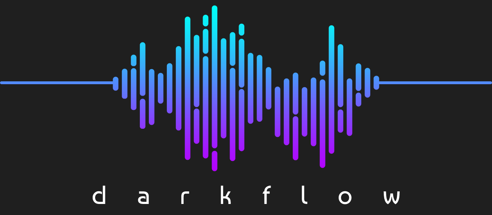

# Darkflow
Streem Persian Music with Recommender System 

## About
Our goal is to build an application that users can listen music & our app recommend songs by their current mood

## Tools
**Radio Javan CLient API**

An api for fetch persian songs 

**Annoy Approximate Nearest Neighbors**

A C++ library with Python bindings to search for points in space that are close to a given query point.

**Audio Embedding Generator**

A library that instantiate and deploy an audio embedding model. This model recognizes a signed 16-bit PCM wav file as an input, generates embeddings, applies PCA transformation/quantization, and outputs the result as arrays of 1 second embeddings. 

